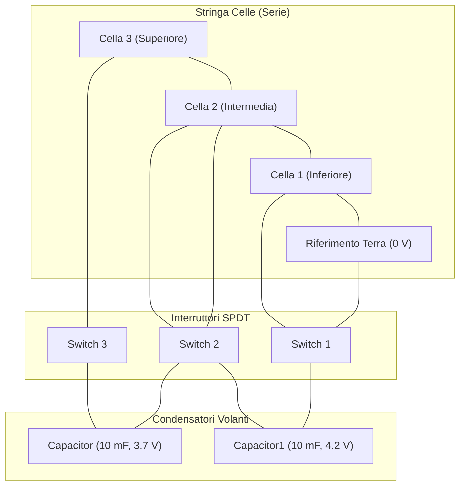
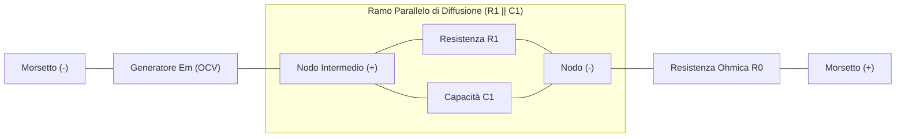

# Analisi Tecnica ed Elettrica del Modello Simulink e Script `init.m`

Questo documento fornisce l'analisi ingegneristica approfondita dello script di inizializzazione [`init.m`](init.m) e del modello Simulink/Simscape [`Balancing_Attivo.slx`](Balancing_Attivo.slx).  
Il sistema simula un circuito di **bilanciamento attivo di carica a condensatori commutati** (*Adjacent Switched-Capacitor Equalizer*) per una stringa di celle agli ioni di litio connesse in serie.

---

## 1. Architettura Generale del Sistema

Il modello rappresenta un pacco batteria composto da **3 celle Li-Ion in serie**, interconnesse tramite una rete di commutazione a ponte formata da:
* **2 Condensatori volanti** (*Flying Capacitors*): elementi di accumulo temporaneo utilizzati come "navetta di carica" per trasferire energia tra celle adiacenti.
* **3 Interruttori a doppio contatto** (**SPDT** - *Single Pole Double Throw*): pilotati da un'onda quadra/triangolare periodica per alternare le fasi di carica e scarica dei condensatori.
* **Sensori di misura e calcolo RMS**: per il monitoraggio continuo di tensioni, correnti e valori efficaci.



---

## 2. Analisi Dettagliata dello Script `init.m`

Lo script [`init.m`](init.m) è basato sull'articolo scientifico IEEE:
> **T. Huria, M. Ceraolo, J. Gazzarri, R. Jackey**, *"High Fidelity Electrical Model with Thermal Dependence for Characterization and Simulation of High Power Lithium Battery Cells"*, IEEE International Electric Vehicle Conference (IEVC), Marzo 2012.

Il modello adotta il circuito equivalente **Thevenin a 1 ramo RC** con parametri variabili in funzione dello stato di carica ($SOC$) e della temperatura ($T$).

### Schema Circuitale Equivalente della Cella (Thevenin 1-RC)

Tutti i componenti all'interno della cella sono collegati **rigorosamente in serie** tra il polo negativo `(-)` e il polo positivo `(+)`:

```
                 ┌─────────────────────────────┐
                 │       Ramo Parallelo        │
                 │         (R1 ∥ C1)           │
                 │                             │
                 │        ┌───[ R1 ]───┐       │
  (-)            │   +    │            │   -   │     +           -            (+)
   o─────(-)[ Em ](+)─────┴────┤  ├───┴───────┼────[ R0 ]─────────────o
                 │              C1             │  (Resistenza
                 │                             │   Ohmica Pura)
                 └─────────────────────────────┘
  (Tensione a Vuoto OCV)    (Sovratensione Dinamica
                             di Diffusione / Polarizzazione)
```



---

### Qual è la Relazione tra $E_m$ e il Ramo $R_1 \parallel C_1$?

La relazione si articola su tre livelli: **circuitale**, **elettrochimico** e **parametrico**.

#### 1. Relazione Circuitale e Modello Matematico a Sistema
Il generatore ideale $E_m$, il gruppo parallelo $R_1 \parallel C_1$ e il resistore $R_0$ sono connessi **in serie**.  
Tutta la corrente $I(t)$ attraversa l'intera catena. Al nodo del parallelo $R_1 \parallel C_1$, per la legge di Kirchhoff delle correnti (KCL), la corrente si ripartisce tra il ramo capacitivo e il ramo resistivo:
$$I(t) = i_{C1}(t) + i_{R1}(t) = C_1 \frac{d v_{C1}(t)}{dt} + \frac{v_{C1}(t)}{R_1}$$

Mettendo a sistema l'**equazione differenziale di stato** del condensatore $C_1$ con l'**equazione algebrica di uscita** alla maglia (KVL), otteniamo il modello dinamico continuo della cella:

$$
\begin{cases}
\dfrac{d v_{C1}(t)}{dt} = -\dfrac{1}{R_1(SOC, T) \cdot C_1(SOC, T)} \, v_{C1}(t) + \dfrac{1}{C_1(SOC, T)} \, I(t) \\[1.6ex]
V_{\text{cell}}(t) = E_m(SOC, T) - v_{C1}(t) - R_0(SOC, T) \cdot I(t)
\end{cases}
$$

> *(Nota sui segni: formulazione in convenzione generatore / scarica, dove $I(t) > 0$ è la corrente erogata dalla cella verso il carico o verso il bilanciatore).*

Includendo anche la dinamica elettrochimica dello stato di carica per integrazione di Coulomb (*Coulomb counting*), il sistema di stato completo del blocco cella diviene:

$$
\begin{cases}
\dfrac{d SOC(t)}{dt} = -\dfrac{\eta_{\text{coulomb}}}{3600 \cdot Q_{\text{nom}}} \, I(t) \\[1.6ex]
\dfrac{d v_{C1}(t)}{dt} = -\dfrac{1}{R_1(SOC, T) \cdot C_1(SOC, T)} \, v_{C1}(t) + \dfrac{1}{C_1(SOC, T)} \, I(t) \\[1.6ex]
V_{\text{cell}}(t) = E_m(SOC, T) - v_{C1}(t) - R_0(SOC, T) \cdot I(t)
\end{cases}
$$

#### Perché la resistenza $R_1$ non compare come termine singolo in $V_{\text{cell}}(t)$?
* **Equipotenzialità del parallelo**: $R_1$ e $C_1$ condividono gli stessi due nodi, quindi hanno per definizione la stessa identica tensione ai loro capi: $v_{R1}(t) = v_{C1}(t)$. Nella somma delle tensioni alla maglia compare la caduta dell'intero blocco una sola volta (denotata convenzionalmente come $v_{C1}(t)$).
* **Ruolo dinamico di $R_1$**: La resistenza $R_1$ è incorporata all'interno dell'equazione differenziale dello stato $v_{C1}(t)$. Essa definisce, insieme a $C_1$, la costante di tempo $\tau_1 = R_1 C_1$ con cui la sovratensione si accumula o si estingue.
* **Comportamento a regime stazionario ($t \to \infty$)**:  
  Se la corrente $I$ è costante nel tempo, il condensatore $C_1$ termina la carica e si comporta come un circuito aperto ($\frac{d v_{C1}}{dt} = 0$, $i_{C1} = 0$). Tutta la corrente attraversa $R_1$:
  $$v_{C1}(\infty) = R_1 \cdot I$$
  Sostituendo nell'equazione di uscita, a regime $R_1$ riappare esplicitamente nella caduta ohmica totale:
  $$V_{\text{cell}}(\infty) = E_m - (R_1 \cdot I) - R_0 \cdot I = E_m - (R_0 + R_1) \cdot I$$
* **A riposo ($I = 0$)**:  
  Il condensatore $C_1$ si scarica spontaneamente su $R_1$ con legge esponenziale $v_{C1}(t) = v_{C1}(0) e^{-t/\tau_1} \to 0\text{ V}$. A riposo prolungato, ai morsetti si misura la pura tensione a vuoto: $V_{\text{cell}} = E_m$.

#### 3. Accoppiamento Parametrico in Simscape
Come visibile nello schema interno della cella ([`dentro_cella.png`](dentro_cella.png)), il blocco `Em_table` calcola per Coulomb counting lo stato di carica $SOC$ istantaneo della cella:
* Il valore calcolato di $SOC$ viene inviato alle porte di controllo di $R_1$, $C_1$ e $R_0$.
* Quindi, $E_m$ non solo determina il livello di tensione base, ma governa anche come variano i valori di $R_1(SOC, T)$ e $C_1(SOC, T)$ lungo le tabelle `R1_LUT` e `C1_LUT`.

---

### 2.1 Punti di Griglia (Breakpoints)
* **`SOC_LUT = [0 0.1 0.25 0.5 0.75 0.9 1]'`**:
  * Vettore colonna dei punti di campionamento del State of Charge, da $0$ (cella scarica, $0\%$) a $1.0$ (cella carica, $100\%$).
* **`Temperature_LUT = [5 20 40] + 273.15`**:
  * Punti di campionamento della temperatura: $5^\circ\text{C}$ ($278.15\text{ K}$), $20^\circ\text{C}$ ($293.15\text{ K}$) e $40^\circ\text{C}$ ($313.15\text{ K}$).

---

### 2.2 Capacità e Tensione a Vuoto ($E_m$)
* **`Capacity_LUT = [28.0081, 27.6250, 27.6392] Ah`**:
  * Capacità estraibile nominale della cella alle 3 temperature. Si tratta di una cella commerciale di grande formato (tipo prismatica/pouch da $\sim 28\text{ Ah}$).
* **`Em_LUT` (Matrice $7 \times 3$, in Volt)**:
  * Tensione a circuito aperto ($E_m$, nota come **OCV** - *Open Circuit Voltage*) determinata dal potenziale elettrochimico di equilibrio (legge di Nernst):
    * A $SOC = 0\%$: $E_m \approx 3.4966 - 3.5148\text{ V}$ (tensione di cut-off inferiore).
    * A $SOC = 50\%$: $E_m \approx 3.7066 - 3.7213\text{ V}$ (tensione nominale classica delle celle agli ioni di litio NMC).
    * A $SOC = 100\%$: $E_m \approx 4.1923 - 4.1930\text{ V}$ (tensione massima di saturazione a fine carica).

---

### 2.3 Resistenza Serie Ohmica ($R_0$)
* **`R0_LUT` (Matrice $7 \times 3$, in Ohm)**:
  * Valori compresi tra **$8.2\text{ m}\Omega$** e **$11.7\text{ m}\Omega$**.
  * **Fisica elettrica**: Rappresenta la resistenza ohmica pura del bulk dell'elettrolita, dei collettori metallici di corrente e dei morsetti.
  * Produce la caduta di potenziale puramente istantanea:
    $$\Delta V_{\text{ohm}} = I \cdot R_0$$
  * **Effetto termico**: A $5^\circ\text{C}$ la resistenza è circa il $30\%$ più alta rispetto a $20^\circ\text{C}$ e $40^\circ\text{C}$, a causa della maggiore viscosità dell'elettrolita e della ridotta mobilità degli ioni $\text{Li}^+$.

---

### 2.4 Ramo di Polarizzazione e Diffusione ($R_1 - C_1$)
* **`R1_LUT` (Matrice $7 \times 3$, in Ohm)**:
  * Resistenza di trasferimento di carica (*Charge Transfer Resistance*): varia tra **$1.0\text{ m}\Omega$** e **$10.9\text{ m}\Omega$**.
* **`C1_LUT` (Matrice $7 \times 3$, in Farad)**:
  * Capacità di doppio strato (*Electrochemical Double-Layer Capacitance*): varia tra **$1'913.6\text{ F}$** e **$48'274\text{ F}$**.
* **Significato elettrico e costante di tempo $\tau_1$**:
  * Modella la dinamica lenta dei transitori di sovratensione di concentrazione e diffusione nei pori degli elettrodi solidi.
  * L'evoluzione della tensione sul ramo RC segue:
    $$\frac{dV_{C1}}{dt} = -\frac{1}{R_1 C_1} V_{C1} + \frac{1}{C_1} I$$
  * Calcolo della costante di tempo a $20^\circ\text{C}$ e $SOC = 50\%$:
    $$\tau_1 = R_1 \cdot C_1 \approx 0.0016\,\Omega \times 18'721\text{ F} \approx 29.95\text{ secondi}$$
  * Questo parametro consente al modello di simulare fedelmente il rilassamento lento della tensione della cella dopo l'interruzione della corrente.

---

### 2.5 Parametri Termici
* **Dimensioni geometriche**:
  * Spessore: $d = 0.0084\text{ m}$ ($8.4\text{ mm}$)
  * Larghezza: $w = 0.215\text{ m}$ ($21.5\text{ cm}$)
  * Altezza: $h = 0.220\text{ m}$ ($22.0\text{ cm}$)
  * Area superficiale esterna: $A_{\text{cell}} = 2(d\cdot w + d\cdot h + w\cdot h) \approx 0.0964\text{ m}^2$
  * Volume: $V_{\text{cell}} = d\cdot w\cdot h \approx 3.973 \cdot 10^{-4}\text{ m}^3$
  * Massa: $M_{\text{cell}} = 1\text{ kg}$
* **Capacità termica volumetrica**: `cell_rho_Cp = 2.04e6 J/(m³·K)`.
* **Capacità termica totale**: `cell_Cp_heat = cell_rho_Cp * cell_volume ≈ 810.5 J/K`.
* **Convezione termica naturale**: `h_conv = 5 W/(m²·K)`.
* **Equazione di bilancio termico**:
  $$M_{\text{cell}} \, c_p \frac{dT}{dt} = \underbrace{I^2 R_0 + I_{R1}^2 R_1}_{P_{\text{Joule}}} - h_{\text{conv}} A_{\text{cell}} (T - T_{\text{amb}})$$

---

### 2.6 Condizioni Iniziali
* **`Qe_init = 15.6845 Ah`**:
  * Rappresenta il deficit di carica iniziale rispetto alla saturazione massima ($27.625\text{ Ah}$).
  * Carica residua effettiva: $Q_{\text{init}} = 27.625 - 15.6845 = 11.9405\text{ Ah}$.
  * $SOC$ iniziale di lavoro:
    $$SOC_{\text{init}} = \frac{11.9405}{27.625} \approx 43.22\%$$
* **`T_init = 293.15 K`** ($20^\circ\text{C}$): temperatura iniziale dell'ambiente e della cella.

---

## 3. Analisi del Modello Simulink `Balancing_Attivo.slx`

### 3.1 Schema delle Celle in Serie
Nel modello, le tre celle (`Cell 01 to 1`, `Cell 01 to 2`, `Cell 01 to 3`) sono collegate in cascata:
* **Polo negativo di Cella 1**: collegato all'**Electrical Reference** Simscape ($0\text{ V}$, massa).
* **Polo positivo di Cella 1**: connesso al polo negativo di Cella 2 tramite sensore di corrente.
* **Polo positivo di Cella 2**: connesso al polo negativo di Cella 3 tramite sensore di corrente.

Ciascuna cella contiene all'interno un blocco Simscape personalizzato che legge direttamente le matrici `Capacity_LUT`, `Em_LUT`, `R0_LUT`, `R1_LUT`, `C1_LUT` e il deficit `Qe_init` da `init.m`.

---

### 3.2 Condensatori Volanti (`Capacitor` e `Capacitor1`)
Entrambi i condensatori hanno caratteristiche circuitali identiche:
* **Capacità**: $C = 1\cdot 10^{-2}\text{ F} = 10\text{ mF}$ ($10'000\,\mu\text{F}$).
* **Resistenza Parassita Serie (ESR)**: $r = 1\cdot 10^{-3}\,\Omega = 1\text{ m}\Omega$.

#### Condizioni Iniziali di Tensione:
* **`Capacitor1`** (inferiore, tra Cella 1 e 2): $v_{c0} = \mathbf{4.2\text{ V}}$.
* **`Capacitor`** (superiore, tra Cella 2 e 3): $v_{c0} = \mathbf{3.7\text{ V}}$.

> [!NOTE]
> Poiché le celle partono da $SOC \approx 43.2\%$ ($V_{\text{cell}} \approx 3.70\text{ V}$), impostare $Capacitor1$ a $4.2\text{ V}$ introduce volutamente uno sbilanciamento di potenziale iniziale di oltre $0.5\text{ V}$. Questo permette di osservare e validare immediatamente la dinamica transitoria di equalizzazione attiva.

---

### 3.3 Interruttori di Commutazione (`Switch1`, `Switch2`, `Switch3`)
Implementati con il blocco Simscape **`SPDT Switch`** (*Single Pole Double Throw*):
* **Resistenza di chiusura**: $R_{\text{closed}} = 0.01\,\Omega = 10\text{ m}\Omega$ (resistenza di canale $R_{ds(on)}$ del MOSFET).
* **Conduttanza di apertura**: $G_{\text{open}} = 10^{-6}\,\Omega^{-1} \implies R_{\text{open}} = 1\text{ M}\Omega$ (elevato isolamento da aperto).
* **Soglia di soglia logica**: $\text{Threshold} = 0.5$.

---

### 3.4 Segnale di Pilotaggio e Frequenza di Switching
Il blocco **`Repeating Sequence`** invia ai tre switch il segnale di controllo:
* **Tempi**: `rep_seq_t = [0, 1.5e-3, 3e-3]` secondi.
* **Ampiezze**: `rep_seq_y = [0, 1, 0]`.
* **Periodo di commutazione**:
  $$T_s = 3\cdot 10^{-3}\text{ s} = 3\text{ ms}$$
* **Frequenza di commutazione**:
  $$f_s = \frac{1}{T_s} = \frac{1}{3\cdot 10^{-3}} \approx 333.33\text{ Hz}$$
* **Duty Cycle**:
  * Poiché il segnale è una rampa triangolare simmetrica che sale da $0$ a $1$ in $1.5\text{ ms}$ e riscende a $0$ nei successivi $1.5\text{ ms}$, esso supera la soglia di $0.5$ per esattamente il $50\%$ del tempo.

---

### 3.5 Fasi di Commutazione e Meccanismo "Charge Shuttle"

Gli interruttori commutano simultaneamente secondo la tabella seguente:

| Fase | Intervallo Temporale | Segnale | Stato Switch | Connessione `Capacitor1` | Connessione `Capacitor` |
|:---:|:---:|:---:|:---:|:---:|:---:|
| **Fase 1 ($\Phi_1$)** | $0 \le t < 1.5\text{ ms}$ | $> 0.5$ | `outT` (True) | In parallelo a **Cella 2** | In parallelo a **Cella 3** |
| **Fase 2 ($\Phi_2$)** | $1.5\text{ ms} \le t < 3\text{ ms}$ | $< 0.5$ | `outF` (False) | In parallelo a **Cella 1** | In parallelo a **Cella 2** |

#### Spiegazione Elettrica del Trasferimento di Carica:
1. **Trasferimento tra Cella 1 e Cella 2**:
   * Nella **Fase 2**, `Capacitor1` è in parallelo alla Cella 1. Se $V_{\text{cell,1}} > V_{C1}$, una quantità di carica $\Delta Q = C (V_{\text{cell,1}} - V_{C1})$ entra nel condensatore.
   * Nella **Fase 1**, `Capacitor1` viene staccato dalla Cella 1 e collegato in parallelo alla Cella 2. Se $V_{C1} > V_{\text{cell,2}}$, il condensatore cede la carica alla Cella 2.
2. **Trasferimento tra Cella 2 e Cella 3**:
   * Nella **Fase 2**, `Capacitor` è collegato alla Cella 2.
   * Nella **Fase 1**, `Capacitor` è collegato alla Cella 3.
3. **Propagazione su tutta la catena**:
   * La Cella 2 funge da snodo bidirezionale comune per entrambi i condensatori: l'energia può propagarsi da qualsiasi cella all'altra lungo l'intera stringa in modo completamente passivo e automatico.

---

## 4. Analisi della Resistenza Equivalente di Commutazione ($R_{eq}$)

A livello medio, il processo di commutazione ad alta velocità di un condensatore si modella come una **resistenza equivalente virtuale** che governa la corrente media di bilanciamento:

$$R_{eq} = \frac{1}{f_s \cdot C} + R_{\text{serie}}$$

### Calcolo con i Valori Reali del Modello:
1. **Resistenza pura di commutazione**:
   $$R_{\text{sw}} = \frac{1}{f_s \cdot C} = \frac{1}{333.33\text{ Hz} \times 0.01\text{ F}} \approx 0.30\,\Omega$$
2. **Resistenze di perdita nel loop di corrente**:
   In ciascuna fase, la maglia chiusa comprende 2 interruttori SPDT in conduzione, l'ESR del condensatore e la resistenza interna $R_0$ della cella:
   $$R_{\text{serie}} = 2 \cdot R_{\text{closed}} + r_{\text{ESR}} + R_{0} \approx (2 \times 0.01) + 0.001 + 0.0085 \approx 0.0295\,\Omega \approx 0.03\,\Omega$$
3. **Resistenza equivalente totale**:
   $$R_{eq, \text{tot}} = 0.30\,\Omega + 0.03\,\Omega = \mathbf{0.33\,\Omega}$$

### Corrente Media di Bilanciamento:
La corrente media scambiata tra due celle aventi differenza di potenziale $\Delta V = V_i - V_j$ è data da:
$$I_{\text{bal, medio}} \approx \frac{\Delta V}{R_{eq}} = \frac{\Delta V}{0.33\,\Omega}$$

* Se $\Delta V = 0.5\text{ V}$, fluisce una corrente media $I_{\text{bal}} \approx \mathbf{1.51\text{ A}}$.
* Se $\Delta V = 0.1\text{ V}$, fluisce una corrente media $I_{\text{bal}} \approx \mathbf{0.30\text{ A}}$.

---

## 5. Struttura di Acquisizione Dati e Configurazione del Solver

### 5.1 Catena di Misura e Visualizzazione
* **Sensori Simscape**:
  * 3 sensori di tensione e 3 di corrente posti sulle celle.
  * 2 sensori di tensione e 2 di corrente posti sui condensatori.
* **Memorie Globali (Data Store Memory)**:
  * `cell_voltage` (vettore $3 \times 1$)
  * `cell_current` (vettore $3 \times 1$)
  * `capacity_voltage` (vettore $2 \times 1$)
  * `capacity_current` (vettore $2 \times 1$)
* **Elaborazione RMS**:
  * Un blocco **`Zero-Order Hold`** campiona le tensioni continue a $T_s = 1\text{ ms}$.
  * Un blocco **`Demux`** separa i tre canali verso 3 blocchi **`Running RMS`** (DSP System Toolbox).
  * Il valore efficace calcolato viene inviato a un display numerico e allo **`Scope1`**.
* **Visualizzazione Completa**:
  * Il blocco **`Scope`** a 4 ingressi traccia simultaneamente tutti i vettori di tensione e corrente.

### 5.2 Parametri del Risolutore Numerico (Solver)
* **Algoritmo di integrazione**: **`ode23t`** (algoritmo trapezoidale con smorzamento numerico per sistemi DAE rigidi).
* **Tolleranze Simscape**:
  * Tolleranza relativa: $1\cdot 10^{-3}$
  * Tolleranza assoluta: $1\cdot 10^{-6}$
  * Passo minimo: $1\cdot 10^{-9}\text{ s}$
* **`EnableSwitchedLinearOptims = on`**:
  * Ottimizza la risoluzione delle reti lineari commutate, evitando ricalcoli completi della matrice Jacobiana a ogni commutazione degli SPDT.
* **Tempo di Stop**: $5'000\text{ secondi}$, sufficiente per osservare il transitorio asintotico di equalizzazione dei potenziali chimici tra le celle.
