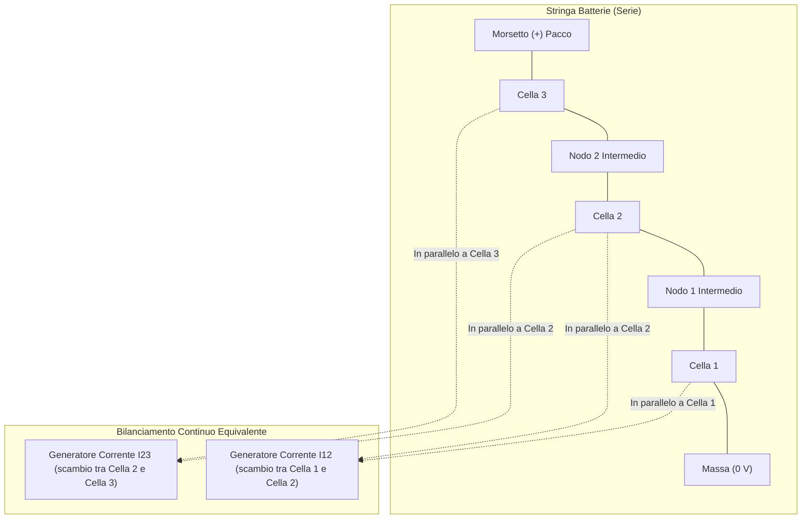

# Guida Completa al Modello Equivalente dei Condensatori Commutati (Switched Capacitors)

Questa guida spiega in modo rigoroso, intuitivo e pratico il concetto di **Modello Equivalente Continuo** (*Averaged Continuous Model*) applicato al bilanciamento attivo delle batterie a condensatori commutati.

---

## 1. Il Problema: Perché serve un Modello Equivalente?

Nei sistemi di accumulo elettrochimico ci troviamo di fronte a un enorme **conflitto di scale temporali**:

1. **La dinamica della batteria è LENTISSIMA**:  
   La carica e scarica di una batteria per veicoli o accumulo stazionario dura **ore** ($3'600 - 18'000\text{ secondi}$). I processi chimici di diffusione durano decine di secondi.
2. **La commutazione del circuito di bilanciamento è RAPIDISSIMA**:  
   Gli interruttori a condensatori commutati lavorano ad alte frequenze ($f_s = 333\text{ Hz}$ in questo modello, fino a $50 - 100\text{ kHz}$ nei circuiti reali), con periodi di millisecondi o microsecondi.

### La conseguenza sulla simulazione:
Se simuli gli interruttori che si aprono e chiudono fisicamente a ogni ciclo per un test di scarica di un'ora:
* Il simulatore numerico di Simulink/Simscape è costretto a calcolare passi temporali nell'ordine dei **microsecondi**.
* Per simulare $5'000\text{ secondi}$ servono decine di milioni di passi di integrazione: la simulazione impiega decine di minuti o ore, i file di log diventano pesantissimi e il solutore rischia errori di convergenza numerica.

> **L'obiettivo del Modello Equivalente**:  
> Eliminare gli interruttori ad alta frequenza e il condensatore, sostituendo l'intero sottosistema con un'**equazione continua a valori medi** che produce lo stesso identico trasferimento netto di carica, velocizzando la simulazione di oltre **1'000 volte**!

---

## 2. La Fisica della Commutazione: Il Principio della "Navetta"

Per capire l'equivalenza, consideriamo due celle adiacenti (Cella 1 e Cella 2) e un condensatore volante $C$:

```
        Fase 1 (0 < t < Ts/2)               Fase 2 (Ts/2 < t < Ts)
        
         Cella 1 (V1)                         Cella 1 (V1)
          ┌───────┐                            ┌───────┐
          │   +   │                            │   +   │
          └───┬───┘                            └───┬───┘
              │  Collegato                         │  Staccato
             ┌┴┐                                   │
             │C│  Si carica a V1                  ┌┴┐
             └┬┘                                  │C│  Si scarica in Cella 2
              │                                   └┬┘
          ┌───┴───┐                                │  Collegato
          │   +   │                            ┌───┴───┐
          │Cella 2│ (V2)                       │   +   │
          └───────┘                            │Cella 2│ (V2)
                                               └───────┘
```

1. **In Fase 1**: Il condensatore viene messo in parallelo alla Cella 1 (tensione $V_1$).  
   La carica accumulata sul condensatore vale:
   $$Q_1 = C \cdot V_1$$
2. **In Fase 2**: Il condensatore viene staccato dalla Cella 1 e collegato alla Cella 2 (tensione $V_2$).  
   La carica finale sul condensatore si porta a:
   $$Q_2 = C \cdot V_2$$
3. **Il pacchetto di carica trasferito ad ogni periodo $T_s$**:
   $$\Delta Q = Q_1 - Q_2 = C \cdot (V_1 - V_2)$$

---

## 3. Derivazione Matematica della Resistenza Equivalente ($R_{eq}$)

La corrente elettrica media è per definizione la quantità di carica trasferita nell'unità di tempo:

$$I_{\text{medio}} = \frac{\Delta Q}{T_s} = \frac{C \cdot (V_1 - V_2)}{T_s}$$

Poiché la frequenza di commutazione è $f_s = \frac{1}{T_s}$, possiamo riscrivere:

$$I_{\text{medio}} = f_s \cdot C \cdot (V_1 - V_2)$$

Riscrivendo questa formula nella forma classica della **Legge di Ohm** ($I = \frac{\Delta V}{R}$):

$$I_{\text{medio}} = \frac{V_1 - V_2}{\left(\dfrac{1}{f_s \cdot C}\right)}$$

Definiamo quindi la **Resistenza di Commutazione Ideale**:
$$R_{\text{sw}} = \frac{1}{f_s \cdot C}$$

### Inclusione delle perdite parassite reali:
In un circuito reale, quando la corrente scorre attraverso il loop chiuso, incontra:
* La resistenza di canale dei 2 MOSFET in conduzione ($2 \cdot R_{\text{on}}$).
* La resistenza parassita serie del condensatore ($r_{\text{ESR}}$).
* La resistenza interna della cella ($R_0$).

La **Resistenza Equivalente Totale** del bilanciatore è quindi:

$$\mathbf{R_{eq} = \frac{1}{f_s \cdot C} + 2 R_{\text{on}} + r_{\text{ESR}} + R_0}$$

### Calcolo con i Valori del Nostro Modello Simulink:
* Frequenza di clock: $f_s = 333.33\text{ Hz}$ (periodo $T_s = 3\text{ ms}$)
* Capacità: $C = 10\text{ mF} = 0.01\text{ F}$
* Resistenza switch: $R_{\text{on}} = 10\text{ m}\Omega = 0.01\,\Omega$
* ESR: $r = 1\text{ m}\Omega = 0.001\,\Omega$
* Resistenza interna cella: $R_0 \approx 8.5\text{ m}\Omega = 0.0085\,\Omega$

$$R_{\text{sw}} = \frac{1}{333.33 \times 0.01} = \frac{1}{3.333} \approx 0.30\,\Omega$$
$$R_{\text{perdite}} = (2 \times 0.01) + 0.001 + 0.0085 \approx 0.0295\,\Omega \approx 0.03\,\Omega$$
$$\mathbf{R_{eq, tot} \approx 0.30 + 0.03 = 0.33\,\Omega}$$

---

## 4. I Due Errori Tipici di Modellazione (Cosa NON Fare)

Nello sviluppo del modello semplificato è facile incappare in due malintesi circuitali:

### Errore 1: Mettere una resistenza al posto del condensatore dentro gli switch
* **Cosa si è tentato di fare**: Sostituire il blocco `Capacitor` con un blocco `Resistor` da $0.33\,\Omega$, lasciando accesi gli interruttori SPDT e il clock.
* **Perché NON funziona**:  
  Un resistore non accumula carica elettrostatica!  
  Quando lo switch lo collega alla Cella 1, il resistore si limita a scaricare la Cella 1 dissipando energia per effetto Joule:
  $$P = \frac{V_1^2}{R} = \frac{(3.7\text{ V})^2}{0.33\,\Omega} \approx 41.5\text{ Watt}$$
  Quando lo switch commuta sulla Cella 2, il resistore si scarica sulla Cella 2 dissipando altri $40\text{ W}$.  
  **Nessuna energia viene trasferita da 1 a 2**: stai solo bruciando energia e scaricando la batteria!

---

### Errore 2: Mettere i generatori di corrente IN SERIE lungo la dorsale delle celle
* **Cosa si è tentato di fare**: Collegare la *Controlled Current Source* tra il polo $(+)$ di una cella e il polo $(-)$ della cella successiva, e poi chiudere la cima del pacco a terra.
* **Perché NON funziona**:
  1. **Violazione KCL**: in un circuito in serie la corrente deve essere identica in ogni punto. Due generatori di corrente ideali in serie che calcolano valori diversi mandano in crash il motore di calcolo (*algebraic loop / conflicting current sources*).
  2. **Corto circuito**: collegare il terminale superiore a massa mette l'intero pacco in cortocircuito.
  3. **Il bilanciamento è un'azione in parallelo**: il bilanciatore agisce come un circuito ausiliario (bypass) sui singoli morsetti di ciascuna cella, mentre la stringa principale rimane collegata in serie.

---

## 5. Come Funziona Correttamente il Modello Equivalente Continuo

Nel modello equivalente continuo:
1. **Rimuoviamo completamente gli interruttori, il generatore di clock e i condensatori volanti.**
2. Le celle della batteria rimangono collegate direttamente in serie tra loro per portare l'eventuale carico principale.
3. Il trasferimento di carica tra celle adiacenti viene modellato tramite **flussi di corrente media controllati**.



---

## 6. Il Sistema Matematico delle Correnti e la Conservazione della Carica

Definiamo i due flussi di scambio elementari tra celle contigue:

1. **Flusso tra Cella 1 e Cella 2**:
   $$I_{12} = \frac{V_1 - V_2}{R_{eq}} = \frac{V_1 - V_2}{0.33}$$
   * Se $V_1 > V_2 \implies I_{12} > 0$: la carica fluisce da Cella 1 a Cella 2.

2. **Flusso tra Cella 2 e Cella 3**:
   $$I_{23} = \frac{V_2 - V_3}{R_{eq}} = \frac{V_2 - V_3}{0.33}$$
   * Se $V_2 > V_3 \implies I_{23} > 0$: la carica fluisce da Cella 2 a Cella 3.

---

### La Corrente Netta Iniettata su Ciascuna Cella ($I_{\text{bal}, i}$)

Definiamo la corrente di bilanciamento $I_{\text{bal}, i}$ come la corrente netta che entra nel morsetto positivo $(+)$ della cella $i$ (corrente di carica):

$$
\begin{cases}
I_{\text{bal, 1}} = -I_{12} = -\dfrac{V_1 - V_2}{0.33} \\[2ex]
I_{\text{bal, 2}} = +I_{12} - I_{23} = \dfrac{V_1 - V_2}{0.33} - \dfrac{V_2 - V_3}{0.33} \\[2ex]
I_{\text{bal, 3}} = +I_{23} = \dfrac{V_2 - V_3}{0.33}
\end{cases}
$$

### Dimostrazione della Conservazione della Carica:
Sommando le tre correnti:
$$I_{\text{bal, 1}} + I_{\text{bal, 2}} + I_{\text{bal, 3}} = (-I_{12}) + (I_{12} - I_{23}) + (I_{23}) \equiv \mathbf{0}$$

La somma algebrica è **rigorosamente zero in ogni istante**: nessuna carica viene creata o distrutta. L'energia viene solo redistribuita all'interno della stringa!

---

## 7. Tabella di Stabilità e Feedback Negativo

Per evitare che il circuito si sbilanci invece di equilibrarsi, il controllo deve implementare un **feedback negativo**:

| Situazione | Differenza di Potenziale | Segno $I_{bal}$ | Effetto Fisico |
|:---:|:---:|:---:|:---:|
| **Cella 1 più carica di Cella 2** ($V_1 > V_2$) | $V_1 - V_2 > 0$ | $I_{\text{bal, 1}} < 0$ (esce da Cella 1)<br>$I_{\text{bal, 2}} > 0$ (entra in Cella 2) | Cella 1 si **scarica**<br>Cella 2 si **carica** $\implies$ **Convergenza** |
| **Cella 2 più carica di Cella 1** ($V_2 > V_1$) | $V_1 - V_2 < 0$ | $I_{\text{bal, 1}} > 0$ (entra in Cella 1)<br>$I_{\text{bal, 2}} < 0$ (esce da Cella 2) | Cella 1 si **carica**<br>Cella 2 si **scarica** $\implies$ **Convergenza** |

---

## 8. Guida all'Implementazione in Simulink / Simscape

Per realizzare il modello equivalente in Simulink:

### Passo 1: Le Celle in Serie
1. Mantieni le 3 celle `Cell 01 to 1`, `Cell 01 to 2`, `Cell 01 to 3`.
2. Connetti:
   * Polo $(-)$ di Cella 1 a Massa (`Electrical Reference` e `Solver Configuration`).
   * Polo $(+)$ di Cella 1 direttamente al polo $(-)$ di Cella 2.
   * Polo $(+)$ di Cella 2 direttamente al polo $(-)$ di Cella 3.

### Passo 2: I Generatori di Corrente Controllata (Controlled Current Source)
Inserisci **3 blocchi `Controlled Current Source`** da Simscape:
* **CCS 1 (in parallelo a Cella 1)**:
  * Terminale con la punta della freccia connesso al polo $(+)$ di Cella 1.
  * Terminale opposto connesso al polo $(-)$ di Cella 1.
  * Porta di controllo pilotata dal segnale: $I_{\text{bal, 1}} = -\frac{V_1 - V_2}{0.33}$.
* **CCS 2 (in parallelo a Cella 2)**:
  * Terminale con la freccia connesso al polo $(+)$ di Cella 2.
  * Terminale opposto connesso al polo $(-)$ di Cella 2.
  * Porta di controllo pilotata dal segnale: $I_{\text{bal, 2}} = \frac{V_1 - V_2}{0.33} - \frac{V_2 - V_3}{0.33}$.
* **CCS 3 (in parallelo a Cella 3)**:
  * Terminale con la freccia connesso al polo $(+)$ di Cella 3.
  * Terminale opposto connesso al polo $(-)$ di Cella 3.
  * Porta di controllo pilotata dal segnale: $I_{\text{bal, 3}} = \frac{V_2 - V_3}{0.33}$.

### Passo 3: Blocchi Matematici di Controllo (Simulink)
1. Estrai le tensioni $V_1, V_2, V_3$ dai sensori di tensione con un blocco `Demux`.
2. Con due blocchi `Subtract` calcola:
   * $\Delta V_{12} = V_1 - V_2$
   * $\Delta V_{23} = V_2 - V_3$
3. Con due blocchi `Gain` impostati a `1/0.33` ottieni i due flussi elementari $I_{12}$ e $I_{23}$.
4. Con opportuni blocchi di somma/sottrazione distribuisci i segnali alle tre porte fisiche delle sorgenti controllate tramite blocchi `Simulink-PS Converter`.

---

## 9. Riepilogo Comparativo

| Caratteristica | Modello a Commutazione (`Balancing_Attivo.slx`) | Modello Equivalente Continuo (`Modello_semplificato.slx`) |
|---|---|---|
| **Componenti Usati** | 2 Condensatori da $10\text{ mF}$, 3 Switch SPDT, segnale onda triangolare. | 3 Controlled Current Sources, blocchi matematici Guadagno/Sottrazione. |
| **Frequenza di Calcolo** | Alta frequenza ($333\text{ Hz}$), richiede passi $\le 10\,\mu\text{s}$. | Tempo continuo / a passi ampi ($\Delta t = 1 - 10\text{ s}$). |
| **Tempo di Esecuzione** | Lento (minuti per simulare poche decine di secondi di batteria). | Quasi istantaneo (pochi decimi di secondo per $5'000\text{ s}$). |
| **Cosa Visualizza** | Le oscillazioni di commutazione e i picchi istantanei di corrente su ogni ciclo. | La traiettoria media delle tensioni e dei $SOC$, identica a lungo termine. |
| **Utilizzo Principale** | Dimensionamento hardware, verifica picchi di corrente su condensatori e MOSFET. | Sviluppo del controllo BMS, simulazioni di missione, controllori predittivi (DMPC). |
